# FORTIGATE-FIREWALL-CONFIGURATION-AND-ACCESS-CONTROL-LAB
In this lab, I configured and managed a FortiGate firewall to implement different security controls such as web filtering, application control, IP restrictions, virtual IP configuration, VPN setup, and role-based administrative access. The aim of the lab was to understand how firewalls can be used to secure enterprise networks, control access, and manage traffic between internal and external networks.

## Objectives

- Understand the configuration and management of a FortiGate firewall
- Implement web filtering and content control
- Restrict access to unwanted applications and websites
- Configure firewall policies and understand policy order
- Block unauthorized IP addresses
- Configure Virtual IPs (VIPs) for external access to internal services
- Set up a site-to-site VPN connection
- Implement role-based access control for firewall administrators

## Lab Environment

In this lab, I used a FortiGate firewall, Microsoft Windows virtual machines, and a Kali Linux virtual machine hosted on VMware Workstation to configure, test, and validate firewall security policies and network access controls.

## Web Filtering Configuration

Under the default profile in the web filter settings, I blocked unwanted websites to prevent users and endpoints behind the firewall from accessing them.

This was done to improve security and limit access to potentially harmful or unnecessary websites.

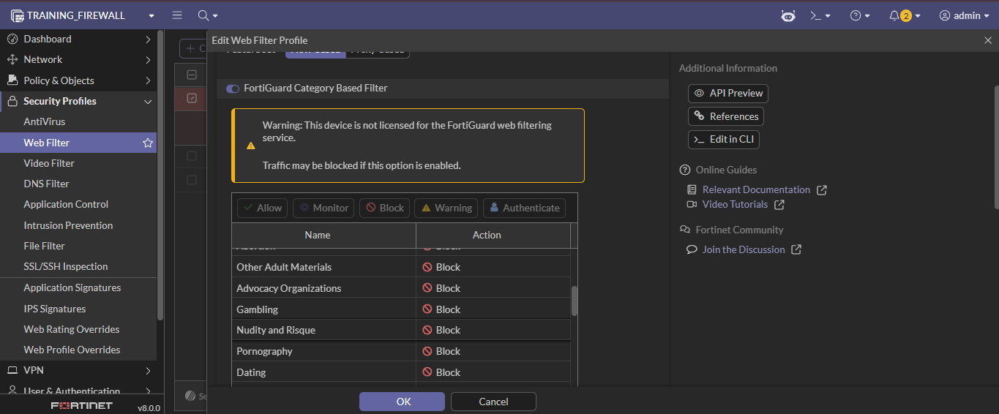

*Figure 1.1: Blocking unwanted websites through the FortiGate web filter profile.*

## Application and IPS Signature Review

I reviewed the application and IPS signatures available on the firewall to identify applications and vulnerabilities that may pose high risks to the network.

This was done to understand which applications or signatures could be blocked in situations where security patches are unavailable.

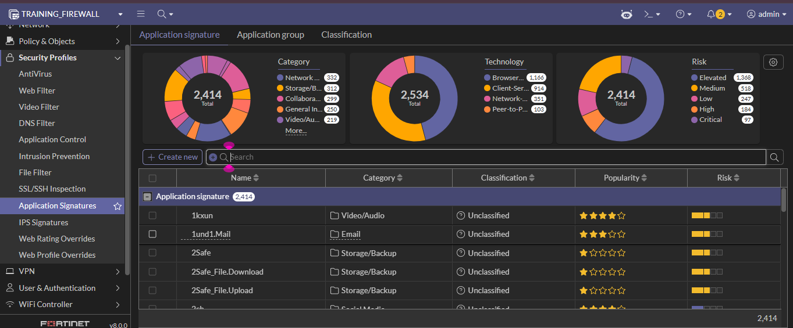

*Figure 2.1: Reviewing application signatures on the firewall.*

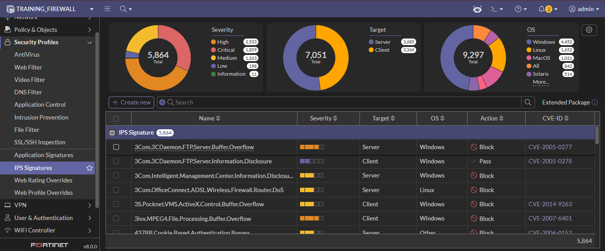

*Figure 2.2: Reviewing IPS signatures and high-risk detections.*

## Streaming Service Restriction

I configured firewall restrictions to block endpoints from accessing streaming services, specifically **Netflix** and **MovieBox**.

To achieve this, I created address objects for both streaming platforms and used wildcard entries to include URLs related to each platform.

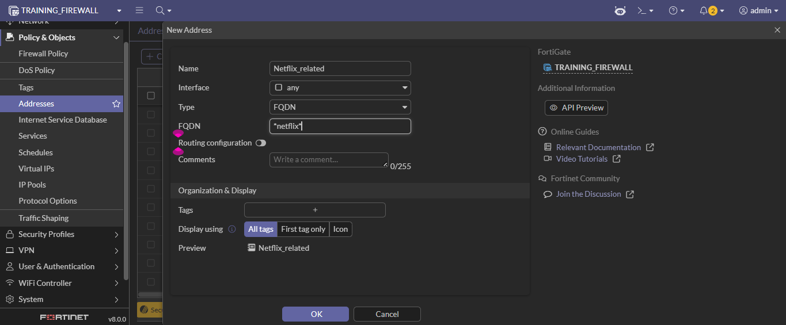

*Figure 3.1: Creating address objects for streaming platforms.*

After creating the addresses, I grouped them into an address group called **Streaming_Platforms**.

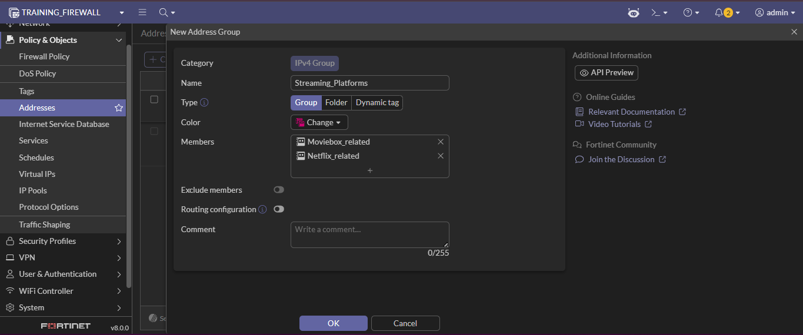

*Figure 3.2: Grouping streaming platform addresses into a single address group.*

I then created a firewall policy and used the address group as the destination object.

An important part of this configuration was the arrangement of the policy. I ensured that the streaming restriction policy was placed above the **LAN to Internet** policy so that the restriction would be enforced first before general internet access was allowed.

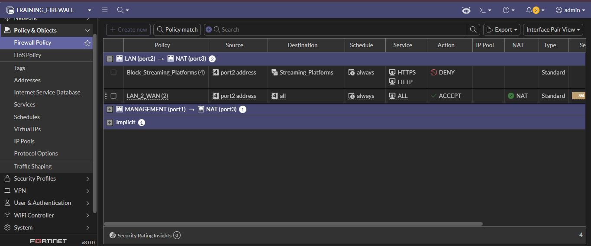

*Figure 3.3: Firewall policy arrangement to prioritize streaming restrictions.*

## Blocking a Specific IP Address

I created an address object to block access to a specific IP address. A comment was also added to explain the reason for blocking the IP address for easier administration and documentation.

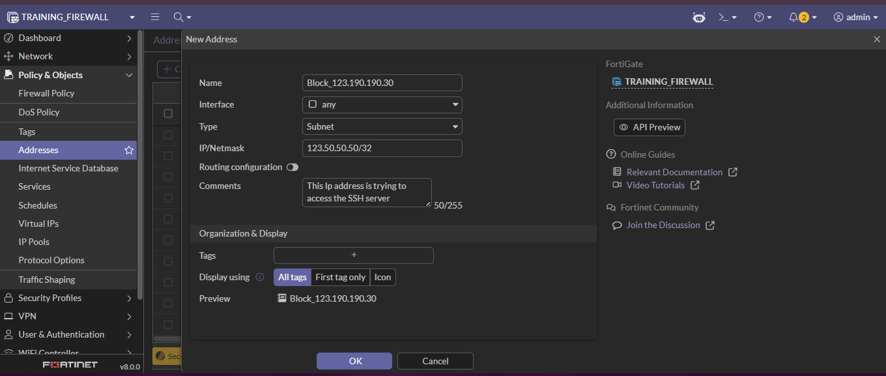

*Figure 4.1: Blocking a specific IP address with documented comments.*

## Virtual IP (VIP) Configuration

I created a Virtual IP (VIP) to allow access to an internal local service through an external IP address that could be routable over the internet.

During the configuration, I specified:

- The external IP address and port to be used by external users
- The private IP address and port of the internal service

This enabled external users to access an internal service through a controlled and defined route.

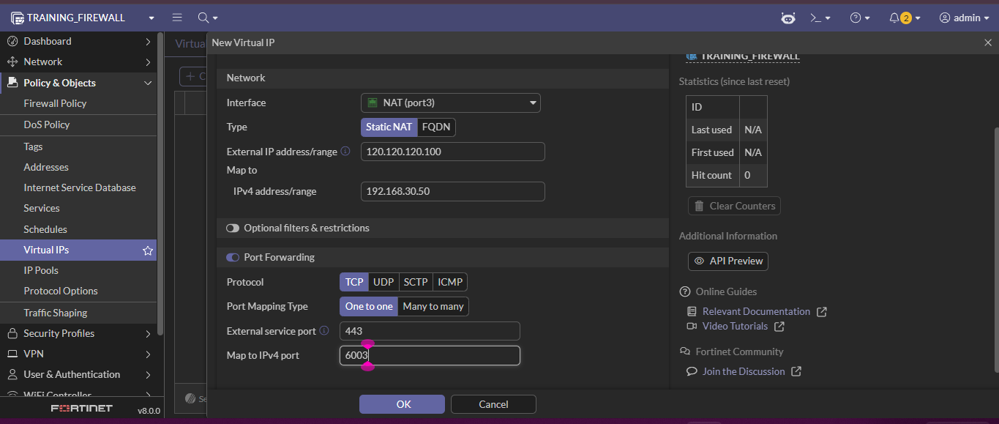

*Figure 5.1: Creating a Virtual IP (VIP) for external access to an internal service.*

After configuring the VIP, I created a firewall policy to allow access through the configured Virtual IP.

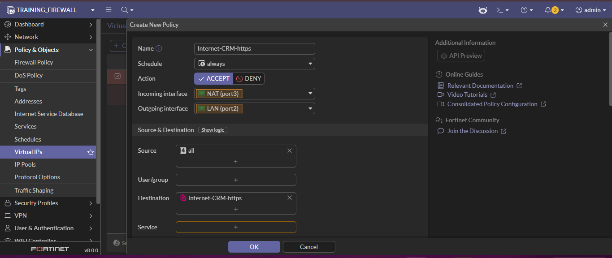

*Figure 5.2: Firewall policy allowing access through the configured VIP.*

## Site-to-Site VPN Configuration

I configured a site-to-site VPN connection and specified a pre-shared key for secure communication between networks.

During the setup, I configured:

- Accessible IP addresses
- Outgoing interfaces
- Local interfaces
- Local subnets allowed to access the VPN

After completing the required settings, I reviewed the configuration and submitted the setup.

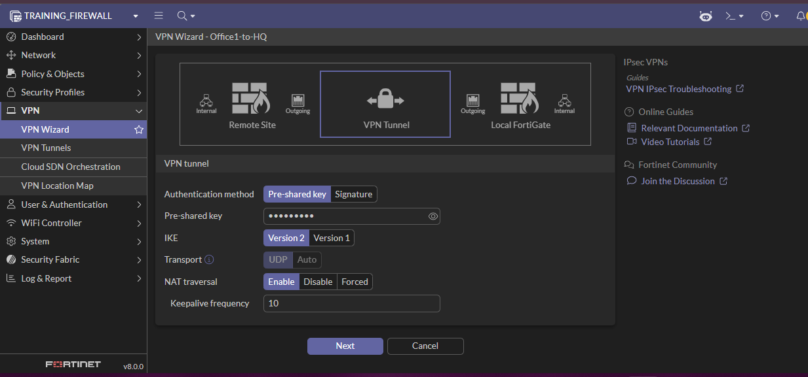

*Figure 6.1: Initial VPN configuration and pre-shared key setup.*

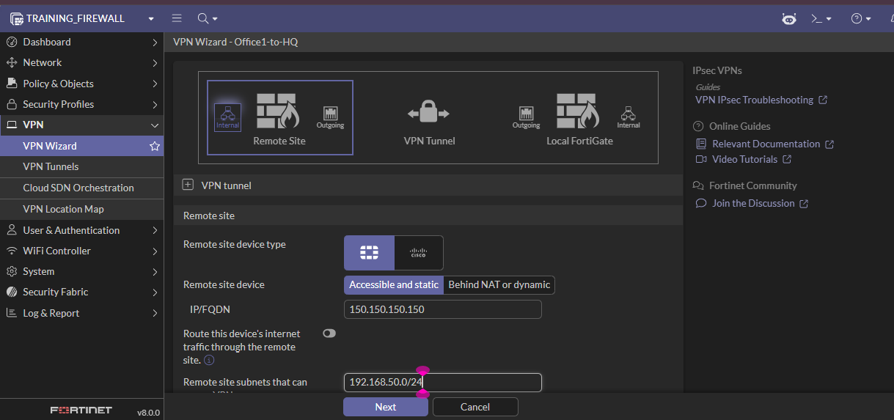

*Figure 6.2: Configuring accessible IP addresses.*

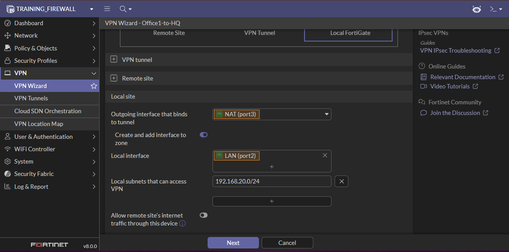

*Figure 6.3: Configuring interfaces and local subnets.*

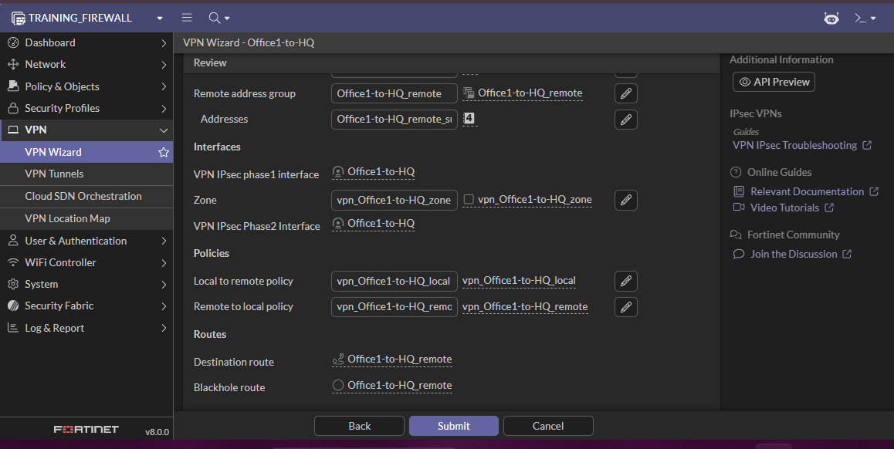

*Figure 6.4: Reviewing and completing VPN configuration.*

## Administrative Access Control

To implement access control on the firewall, I created different administrator profiles for different users based on their responsibilities.

For example, I created profiles for:

- **IT_Intern**
- **Junior_SOC_Analyst**

These profiles were created to limit and control the level of access users had on the firewall.

For the **IT_Intern** profile, most permissions were configured as **read-only** to reduce the risk of unwanted configuration changes.

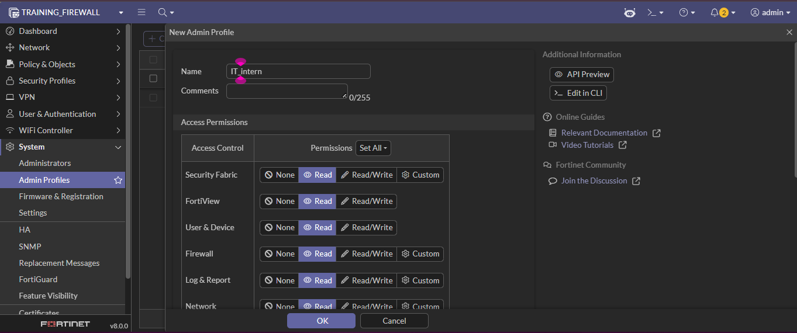

*Figure 7.1: Creating an administrator profile for IT interns.*

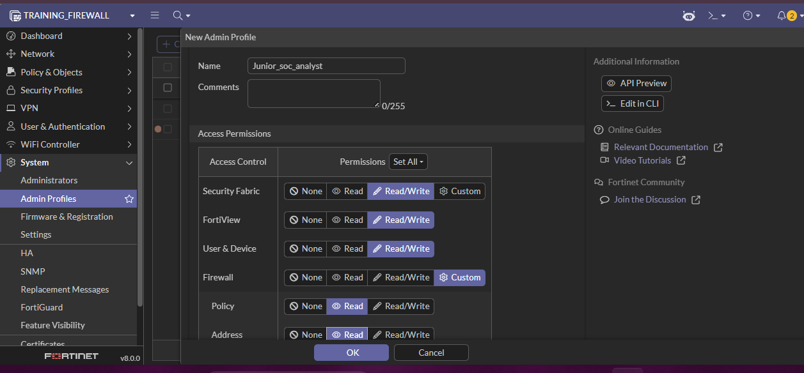

*Figure 7.2: Creating an administrator profile for a junior SOC analyst.*

After creating the profiles, I created user accounts and assigned the appropriate administrator profile to each user.

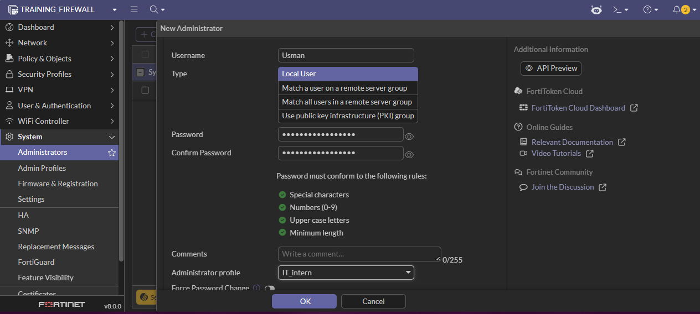

*Figure 7.3: Assigning administrator profiles to firewall users.*

Additionally, I restricted the **IT_Intern** administrator account to log in only from a trusted host computer with a specified IP address to control the devices allowed to access the firewall.

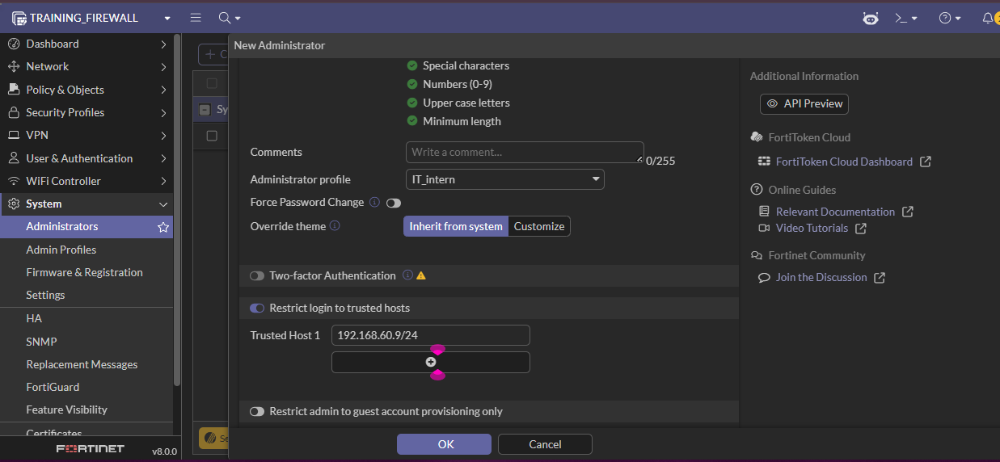

*Figure 7.4: Restricting firewall login to a trusted host device.*

## Findings and Challenges

### Findings

- Web filtering policies successfully blocked unwanted websites from endpoints behind the firewall.
- Application and IPS signatures were reviewed to identify high-risk applications and vulnerabilities.
- Streaming services such as **Netflix** and **MovieBox** were successfully restricted through firewall policies.
- Firewall policy arrangement was important in ensuring restrictions were enforced before general internet access policies.
- Virtual IP (VIP) configuration successfully enabled controlled access to internal services through an external IP address.
- A site-to-site VPN was successfully configured using a pre-shared key and subnet definitions.
- Administrative access was controlled using role-based administrator profiles and trusted host restrictions.
- Kali Linux was successfully used to validate and test firewall policies and access restrictions.

### Challenges

- Understanding firewall policy arrangement was important to ensure policies were enforced in the correct order.
- Careful configuration was required when creating wildcard addresses and firewall rules to avoid unintentionally allowing traffic.

## Skills Demonstrated

Through this lab, I demonstrated the following technical skills:

- FortiGate Firewall Configuration
  
- Firewall Policy Configuration and Management
  
- Web Filtering and Content Restriction
  
- Application Control and IPS Awareness
  
- Network Access Control
  
- Virtual IP (VIP) Configuration
  
- Site-to-Site VPN Configuration
  
- Role-Based Access Control (RBAC)
  
- Firewall Policy Validation and Testing
  
- Security Policy Enforcement
  
- Network Security Administration
